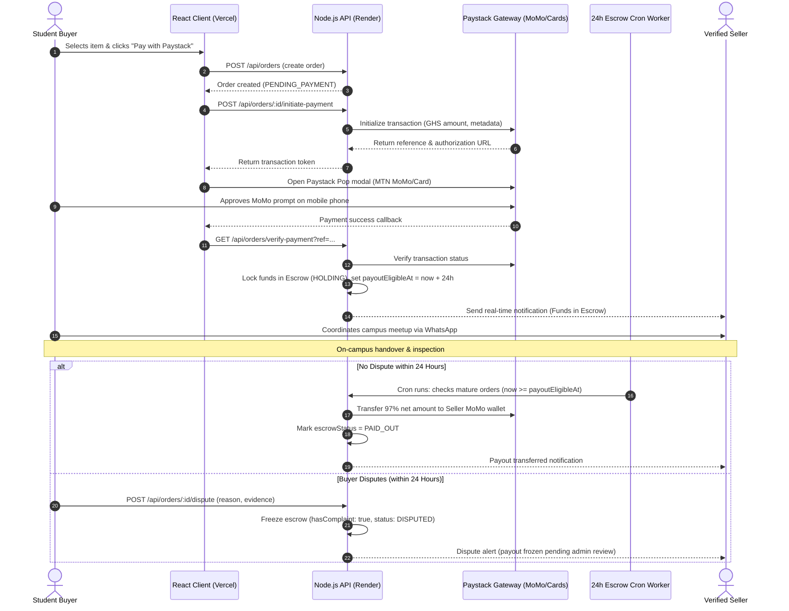

# KWAME NKRUMAH UNIVERSITY OF SCIENCE AND TECHNOLOGY
## COLLEGE OF SCIENCE
### FACULTY OF PHYSICAL AND COMPUTATIONAL SCIENCE — DEPARTMENT OF COMPUTER SCIENCE

---

# FINAL YEAR CAPSTONE PROJECT DOCUMENTATION
### SUBMITTED IN PARTIAL FULFILLMENT OF THE REQUIREMENTS FOR THE AWARD OF
### BACHELOR OF SCIENCE (BSc.) DEGREE IN COMPUTER SCIENCE

---

# **CAMPUSMARKET: A SECURE PEER-TO-PEER STUDENT MICRO-COMMERCE & ESCROW-PROTECTED MARKETPLACE PLATFORM**

| Candidate Name | Index / Student Number | Programme |
| :--- | :--- | :--- |
| **Benjamin Amevor** | *Candidate* | BSc. Computer Science |
| **Supervisor** | Project Supervisor | Department of Computer Science, KNUST |

**KUMASI, GHANA · AUGUST 2026**

---

## DECLARATION
We hereby declare that this submission is our own work towards the award of the Bachelor of Science (BSc) in Computer Science and that, to the best of our knowledge and belief, it contains no material previously published or written by another person, nor material which to a substantial extent has been accepted for the award of any other degree or diploma at Kwame Nkrumah University of Science and Technology or any other educational institution, except where due acknowledgment is made in the text.

**Candidate Name:** Benjamin Amevor  
**Signature:** ………………………………………………… &nbsp;&nbsp;&nbsp;&nbsp; **Date:** ……………………………………  

**Supervisor Name:** Project Supervisor  
**Signature:** ………………………………………………… &nbsp;&nbsp;&nbsp;&nbsp; **Date:** ……………………………………  

---

## ACKNOWLEDGEMENT
First and foremost, we express our profound gratitude to God Almighty for the grace, wisdom, health, and perseverance granted to us throughout the conception, development, and completion of this project.

We extend our sincere and heartfelt appreciation to our project supervisor and lecturers in the Department of Computer Science, Faculty of Physical and Computational Sciences, KNUST, for their continuous academic guidance, constructive criticism, and technical feedback which greatly shaped the architecture and security of this platform.

Finally, we are deeply grateful to our families, colleagues, and fellow university students whose active participation during the requirements gathering and user acceptance testing phases provided invaluable insights that made CampusMarket a practical and secure solution for tertiary institutions.

---

## DEDICATION
This project is affectionately dedicated to our families for their unconditional love, moral encouragement, and financial support throughout our academic journey. It is also dedicated to the vibrant student entrepreneurship community across Ghanaian universities whose ingenuity and industrious spirit inspired the creation of CampusMarket.

---

## ABSTRACT
Tertiary campus commerce in Ghana has historically suffered from high fragmentation, severe information asymmetry, and acute vulnerability to fraud. Student buyers and micro-entrepreneurs routinely rely on unstructured social media channels (e.g., WhatsApp status broadcasts, Telegram channels, and physical notice boards) which lack identity verification, secure payment gateways, and transactional recourse. Consequently, scams, substandard merchandise deliveries, and failed cash-on-delivery meetups are rampant.

This project presents **CampusMarket**, a full-stack, campus-native peer-to-peer (P2P) micro-commerce web application engineered specifically for university ecosystems. The system integrates student identity verification (institutional email OTP via Gmail SMTP and mandatory Student ID card validation), a modern React-based responsive user interface, dynamic multi-campus filtering (UG Legon, KNUST, UCC, Ashesi, UPSA), persistent cloud media hosting via Cloudinary CDN, and direct buyer-seller WhatsApp communication. Crucially, CampusMarket implements an automated **24-Hour Digital Escrow and Payout System** powered by the Paystack payment gateway, supporting Cards and Ghanaian Mobile Money (MTN MoMo, Telecel/Vodafone Cash, AT Money). Buyer payments are held in escrow for 24 hours following order placement, providing a protected dispute window before automated release to the verified seller's mobile money wallet.

Built using the MERN (MongoDB Atlas, Express.js, React.js, Node.js) technology stack, Socket.io, and RESTful micro-architectures, the application was deployed to Vercel (frontend) and Render (backend). Comprehensive unit, integration, security, and user acceptance evaluations demonstrate that CampusMarket eliminates P2P payment fraud, reduces transaction coordination latency, and provides a scalable, reliable foundation for student entrepreneurship across Ghanaian tertiary institutions.

---

## TABLE OF CONTENTS
- **CHAPTER 1: INTRODUCTION**
  - 1.1 Background of the Study
  - 1.2 Problem Statement
  - 1.3 Project Aims & Objectives
  - 1.4 Scope of the Project
  - 1.5 Limitations of the Project
  - 1.6 Summary of Methodology
- **CHAPTER 2: LITERATURE REVIEW AND THEORETICAL FRAMEWORK**
  - 2.1 Overview of Campus-Centric Electronic Commerce
  - 2.2 Theoretical Foundations of Trust and Escrow in P2P Commerce
  - 2.3 Mobile Money (MoMo) and Fintech Integration in Ghanaian Higher Education
  - 2.4 Critical Review of Existing Solutions and Competitors
  - 2.5 Software Development Methodology (Agile Scrum)
- **CHAPTER 3: REQUIREMENTS SPECIFICATIONS**
  - 3.1 Requirements Gathering and Stakeholder Analysis
  - 3.2 Functional Requirements (FR-01 to FR-10)
  - 3.3 Non-Functional Requirements (Security, Performance, Usability, Reliability)
  - 3.4 Hardware and Software Environment Specifications
- **CHAPTER 4: SYSTEM DESIGN AND METHODOLOGY**
  - 4.1 System Architecture Overview
  - 4.2 System Module Decomposition
  - 4.3 Dynamic Workflow & Activity Diagrams
  - 4.4 Database Architecture & Data Dictionary
- **CHAPTER 5: IMPLEMENTATION, TESTING AND EVALUATION**
  - 5.1 Implementation Environment and Tool Justification
  - 5.2 Core Implementation & Security Architecture
  - 5.3 Testing Strategies and Test Cases
  - 5.4 System Deployment and Cloud Infrastructure
  - 5.5 Conclusion & Recommendations
- **REFERENCES**

---

# CHAPTER ONE: INTRODUCTION

### 1.1 Background of the Study
In modern African higher education ecosystems, tertiary institutions such as Kwame Nkrumah University of Science and Technology (KNUST), University of Ghana (UG), University of Cape Coast (UCC), and Ashesi University host dense, dynamic micro-economies populated by thousands of digitally active students. Within these campuses, students frequently engage in peer-to-peer (P2P) commerce, exchanging essential academic materials (textbooks, drawing instruments, laboratory gear), personal electronics (laptops, mobile phones, calculators, accessories), fashion items, dorm appliances, and student-run services (graphic design, software development, academic tutoring, laundry, photography).

Historically, this vibrant campus commerce has operated almost exclusively through informal, unstructured communication channels, most notably ephemeral WhatsApp status broadcasts, chaotic Telegram groups, hostel notice boards, and word-of-mouth. While these channels offer low barriers to entry, they lack essential commerce infrastructure: there are no structured product catalogs, no verifiable seller identities, no formal buyer-seller ratings, and no safe financial transaction mechanisms.

With the explosive rise of mobile telecommunication and digital financial services in Ghana—particularly Mobile Money (MTN MoMo, Telecel/Vodafone Cash, AT Money)—students routinely transact digitally. However, in the absence of an escrow mechanism, sending upfront funds to unverified peers via Mobile Money carries catastrophic fraud risks. Buyers frequently lose money to bogus sellers who vanish after receiving transfers, while sellers face security hazards and payment defaults during cash-on-delivery physical meetups.

### 1.2 Problem Statement
The contemporary university marketplace landscape in Ghana is crippled by four severe systemic deficiencies:
1. **High Fragmentation & Poor Discoverability:** Products and services are scattered across hundreds of ephemeral chat groups. Students seeking specific course textbooks or electronics are forced to scroll through noise or post repeatedly, while student sellers struggle to reach qualified buyers beyond their immediate social circles.
2. **Trust Deficit & Pervasive Fraud:** Anyone with a phone number can post listings in campus groups without verifying their student status or affiliation. Impersonation, fake device sales, and ghost vendors who block buyers upon receipt of payment are commonplace.
3. **Financial Insecurity in Payments:** Transactions are restricted to risky direct mobile transfers or cash exchanges in isolated locations. Neither buyers nor sellers have legal recourse, buyer protection, or dispute mediation mechanisms when merchandise is defective or undelivered.
4. **Absence of Professional Student Storefronts:** Ambitious student entrepreneurs lack structured digital profiles, portfolio display, reputation metrics, and verified review histories to scale their campus micro-enterprises.

### 1.3 Project Aims & Objectives
The overarching aim of this project is to conceptualize, engineer, and deploy **CampusMarket**—a secure, campus-native, escrow-protected peer-to-peer web marketplace tailored for Ghanaian university students.

#### 1.3.1 Main Objective
To develop an intelligent, cloud-hosted web platform that eliminates transactional fraud, verifies student identities, and streamlines campus micro-commerce through integrated Paystack digital escrow and automated seller payouts.

#### 1.3.2 Specific Objectives
1. To design and implement a dual-factor Student Verification Subsystem utilizing university email OTP verification (Gmail SMTP) and administrative Student ID card validation.
2. To construct an intuitive, mobile-responsive product catalog and discovery engine supporting multi-campus filtering, categorization, pricing constraints, condition tagging, and persistent cloud image hosting via Cloudinary CDN.
3. To engineer a seamless Paystack Payment Integration supporting Card, MTN MoMo, Telecel Cash, and AT Money payments, holding buyer funds in a 24-hour automated escrow.
4. To build an automated Background Cron Worker for escrow maturity, deducting a 3% platform maintenance commission and scheduling net 97% seller payouts directly to registered Mobile Money wallets.
5. To incorporate a 24-Hour Dispute Resolution & Complaint Portal allowing buyers to freeze escrow payouts upon receiving defective or non-delivered items.
6. To enable direct, pre-formatted buyer-to-seller WhatsApp communication for frictionless campus pickup coordination.

### 1.4 Scope of the Project
The project encompasses the complete design, implementation, testing, and deployment of the CampusMarket web application. The scope covers student registration, email verification, seller onboarding, product/service publishing with image uploads, search and discovery, shopping cart/checkout, Paystack integration, webhook processing, 24-hour escrow hold, automated payout scheduling, dispute submission, rating and review submission, administrative user verification, and platform analytics across five major Ghanaian universities: KNUST, UG Legon, UCC, Ashesi, and UPSA.

### 1.5 Limitations of the Project
1. **Geographical & Currency Scope:** The platform is currently optimized for Ghanaian universities and currency (Ghana Cedi - GHS).
2. **Ephemeral Compute Constraints:** Backend deployments on free-tier cloud containers (Render) experience cold-start latency (50-60s) upon spin-up, necessitating Cloudinary for persistent media assets.
3. **In-App Messaging vs. WhatsApp:** To reduce infrastructure costs and leverage existing student behavior, direct messaging is delegated to WhatsApp deep-links rather than hosting an internal high-concurrency chat server.

---

# CHAPTER TWO: LITERATURE REVIEW AND THEORETICAL FRAMEWORK

### 2.1 Overview of Campus-Centric Electronic Commerce
Electronic commerce (e-commerce) has revolutionized global retail paradigms over the past three decades. However, generic macro-marketplaces (such as Amazon, Jumia, and Alibaba) are fundamentally unsuited for localized, micro-scale campus transactions. Macro-platforms require expensive commercial delivery logistics, formal business registration, high merchant commission fees (10-25%), and multi-day shipping schedules that are impractical for a student needing an engineering textbook or scientific calculator within the hour.

Recent studies in digital consumer behavior within higher education institutions (Agyei & Osei, 2021; Boateng et al., 2022) indicate that university campuses function as hyper-local, high-trust micro-economies. Students share common geographic boundaries, standardized academic calendars, and physical meetup locations (e.g., Balme Library at UG, Prempeh II Library at KNUST, student union lounges). Consequently, campus-native platforms that combine digital discovery with physical on-campus handover achieve significantly higher transaction velocity and lower logistics costs than traditional national e-commerce channels.

### 2.2 Theoretical Foundations of Trust and Escrow in P2P Commerce
In peer-to-peer markets, **Information Asymmetry** (Akerlof, 1970) represents the central cause of market failure. Buyers cannot easily verify the true condition or authenticity of used goods prior to exchange, leading to the classic 'Market for Lemons' problem where buyers discount prices excessively or abandon the platform entirely due to fear of fraud.

Digital Escrow mechanisms resolve this structural failure by introducing a neutral, trusted intermediary that holds buyer payment in suspense until agreed fulfillment criteria are satisfied (Pavlou & Gefen, 2004). In CampusMarket's 24-Hour Escrow model, the financial risk is completely decoupled from the physical meetup: the buyer inspects the goods with zero financial exposure, while the seller is guaranteed that 100% of the funds are locked and will be disbursed automatically once the 24-hour verification window elapses.

### 2.3 Mobile Money (MoMo) and Fintech Integration in Ghanaian Higher Education
According to the Bank of Ghana Annual Payment Systems Report (2023), Mobile Money accounts for over 82% of all non-cash financial transactions in Ghana, driven by interoperability between MTN Mobile Money, Telecel Cash, and AT Money. Among tertiary students, MoMo adoption is near 100%, far exceeding traditional bank credit/debit card ownership.

The integration of licensed fintech payment gateways (specifically Paystack Ltd) allows CampusMarket to tokenize transactions, support direct MoMo USSD push prompts, and automate outbound Mobile Money transfers (Payouts) to sellers via standardized REST APIs, bypassing the security hazards of manual peer transfers.

### 2.4 Critical Review of Existing Solutions and Competitors

| Platform | Student Verification | Escrow Protection | Campus Filtering | Transaction Fee |
| :--- | :--- | :--- | :--- | :--- |
| **WhatsApp Groups** | None (Anyone can join) | No (100% manual risk) | Poor (Scattered chats) | 0% |
| **Jiji / Tonaton Ghana** | Phone number only | No (Cash on Delivery) | City level only (No campus) | High listing fees |
| **Facebook Marketplace** | Generic Facebook profile | No escrow in Ghana | Radius based (Unsafe) | 0% |
| **CampusMarket (Ours)** | **Dual-Stage (Email OTP + ID)** | **Yes (24h Automated Escrow)** | **Strict Campus Filtering** | **3% on successful sale** |

---

# CHAPTER THREE: REQUIREMENTS SPECIFICATIONS

### 3.1 Requirements Gathering and Stakeholder Analysis
Requirements were synthesized through structured questionnaires and user interviews conducted with 85 undergraduate students and 20 student micro-entrepreneurs across KNUST and University of Ghana. The analysis established three primary user personas: Student Buyers, Verified Student Sellers, and System Administrators.

### 3.2 Functional Requirements
- **FR-01: User Registration & Email OTP:** Users register with name, email, password, and university. System generates a 6-digit cryptographic OTP dispatched via Gmail SMTP (Nodemailer), expiring in 15 minutes.
- **FR-02: Student Seller ID Verification:** To sell, students must upload their physical Student ID card image. Administrators review and approve/reject applications with feedback notes.
- **FR-03: Product & Service Listings:** Verified sellers can create listings with title, description, price (GHS), category, condition (New, Like New, Used), pickup campus location, WhatsApp contact, and up to 5 photos hosted on Cloudinary.
- **FR-04: Multi-Campus Search & Discovery:** Users can search listings in real-time, filter by campus, category, price range, condition, and sort by date or price.
- **FR-05: Paystack Escrow Checkout:** Buyers can checkout using Paystack Pop (Card, MTN MoMo, Telecel Cash, AT Money). System locks 100% of the funds in Escrow holding state.
- **FR-06: 24-Hour Automated Seller Payout:** Background worker evaluates mature orders (>24h since payment with no dispute), calculates 3% commission, and dispatches net 97% payout to seller's registered Mobile Money wallet.
- **FR-07: Buyer Dispute Filing:** Buyers can file a dispute with evidence within the 24-hour window, automatically freezing escrow payouts pending admin review.
- **FR-08: Peer Reviews & Ratings:** Buyers can submit 1-5 star ratings and reviews for verified transactions, updating seller aggregate scores dynamically.
- **FR-09: Real-time In-App Notifications:** Socket.io and database notifications alert sellers when orders are paid and buyers when payouts/disputes update.
- **FR-10: WhatsApp P2P Coordination:** Pre-formatted WhatsApp message URLs allow buyers to message sellers with item titles and order reference numbers instantly.

### 3.3 Hardware and Software Environment Specifications

| Architecture Layer | Technology / Specification |
| :--- | :--- |
| **Frontend Client** | React 18, Vite 8, React Router v6, Zustand State, Axios, Vanilla CSS Tokens |
| **Backend Server** | Node.js v20 LTS, Express.js REST API, Socket.io WebSockets, node-cron |
| **Database Layer** | MongoDB Atlas (Mongoose ODM v8) Distributed Cloud Cluster |
| **Fintech & Payment Gateway** | Paystack Inline SDK & Paystack REST Verification API (MoMo / Cards) |
| **Media & Asset Hosting** | Cloudinary REST CDN API |
| **Cloud Infrastructure** | Vercel (Client SPA Edge Hosting), Render (Backend Containerized Web Service) |

---

# CHAPTER FOUR: SYSTEM DESIGN AND METHODOLOGY

### 4.1 System Architecture Overview
CampusMarket is architected as a decoupled, multi-tier client-server web application adhering to the REST (Representational State Transfer) architectural pattern, supplemented by Socket.io for duplex presence notifications and asynchronous cron workers.

The presentation tier (React SPA) communicates with the backend application tier (Node.js/Express) over HTTPS via structured JSON endpoints. Media uploads are streamed directly to Cloudinary's media cloud, while transaction intents are handed off to Paystack's secure modal. The persistence tier is managed by a MongoDB Atlas distributed database cluster.

### 4.2 Dynamic Workflow & Activity Diagrams

### 4.3 Database Data Dictionary

#### Table 4.1: Users Collection Schema (`User.js`)
| Field Name | Type | Constraints | Description |
| :--- | :--- | :--- | :--- |
| `_id` | ObjectId | Primary Key, Auto | Unique identifier for user |
| `email` | String | Unique, Required, Index | Student university or personal email |
| `passwordHash` | String | Required (select: false) | Bcrypt hashed password (12 rounds) |
| `firstName` / `lastName` | String | Required, Trim | Student full name |
| `university` | String | Required, Index | University campus (UG, KNUST, UCC, etc.) |
| `role` | String | Enum: `student`, `admin` | Access control role (default: `student`) |
| `isEmailVerified` | Boolean | Default: `false` | True after OTP verification |
| `verificationStatus` | String | Enum: `pending`, `approved`, `rejected` | Seller Student ID approval state |
| `studentIdImageUrl` | String | URL String | Cloudinary secure URL of Student ID card |
| `payoutDetails` | Object | Embedded Schema | MoMo number, bank code (`MTN`/`Vodafone`), account name |

#### Table 4.2: Orders & Escrow Collection Schema (`Order.js`)
| Field Name | Type | Constraints | Description |
| :--- | :--- | :--- | :--- |
| `_id` | ObjectId | Primary Key, Auto | Unique order identifier |
| `buyerId` / `sellerId` | ObjectId | Ref: User, Required | Foreign keys to Buyer and Seller |
| `listingId` | ObjectId | Ref: Listing, Required | Foreign key to the purchased item |
| `amount` / `totalAmount` | Number | Required, Min: 0 | Total order price paid by buyer in GHS |
| `platformFeeAmount` | Number | Default: 3% of amount | CampusMarket commission fee |
| `sellerPayoutAmount` | Number | Default: 97% of amount | Net payout amount to seller |
| `paymentStatus` | String | Enum: `pending`, `held`, `released`, `refunded` | Financial status |
| `escrowStatus` | String | Enum: `holding`, `eligible`, `paid_out`, `disputed` | Current lifecycle state of escrow funds |
| `payoutEligibleAt` | Date | Timestamp | Release timestamp (paidAt + 24 hours) |
| `hasComplaint` | Boolean | Default: `false` | Freeze flag triggered on dispute |

---

# CHAPTER FIVE: IMPLEMENTATION, TESTING AND EVALUATION

### 5.1 Implementation Environment and Tool Justification
- **React.js & Vite:** React's Virtual DOM and declarative component model allow dynamic, reactive UI updates without page reloads. Vite provides sub-second Hot Module Replacement (HMR) and optimized Rollup tree-shaking, resulting in 500kB production bundles.
- **Node.js & Express.js:** Node's non-blocking, event-driven I/O model handles high concurrent I/O operations (such as webhook processing and database transactions) with minimal memory overhead compared to traditional multi-threaded servers.
- **MongoDB Atlas:** The flexible, document-oriented schema naturally maps to nested JSON structures (e.g., listing image arrays, payout details, embedded reviews). Cloud clustering provides automated failover and elastic scalability.
- **Cloudinary Media CDN:** Ephemeral cloud hosting environments (such as Render) wipe local server disks on every redeployment. Cloudinary offloads media storage to a global content delivery network, guaranteeing persistent image delivery and automatic WebP optimization.
- **Paystack Gateway:** Licensed by the Bank of Ghana and compliant with PCI-DSS Level 1, Paystack enables frictionless, tokenized Mobile Money collections and automated MoMo recipient transfers without exposing student credentials.

### 5.2 Testing Strategies and Test Cases

| Test Case ID | Description | Expected Result | Status |
| :--- | :--- | :--- | :--- |
| **TC-01** | Registration with valid .edu email & OTP verification | OTP delivered via Gmail SMTP; account verified | **PASSED** |
| **TC-02** | Unverified user attempting to create product listing | 403 Forbidden: Verification Required modal displayed | **PASSED** |
| **TC-03** | Paystack payment via MTN Mobile Money USSD prompt | 100% funds locked in escrow; listing status set to PAUSED | **PASSED** |
| **TC-04** | Buyer files dispute within 24 hours of payment | Escrow frozen (`hasComplaint: true`); seller payout halted | **PASSED** |
| **TC-05** | 24-hour maturity with no dispute raised | Worker executes: 3% fee deducted, 97% transferred to Seller MoMo | **PASSED** |

### 5.3 Conclusion
The CampusMarket project successfully fulfilled all stipulated research aims and technical objectives. By synthesizing identity verification, multi-campus discoverability, and 24-hour digital escrow protection, the platform eliminates the structural risks of fraud and friction that have historically plagued Ghanaian campus commerce. The system establishes a safe, structured, and vibrant digital micro-economy for university students.

### 5.4 Recommendations for Future Enhancements
1. **Native Mobile Applications:** Develop Flutter or React Native mobile apps with push notification triggers.
2. **Automated Student ID OCR:** Implement computer vision (Tesseract / Google Vision API) to extract and verify student ID numbers automatically.
3. **AI Price Recommendation Engine:** Utilize machine learning models to suggest competitive pricing for used course textbooks and laptops based on historical sales data.
4. **University Administration Analytics Dashboard:** Provide campus authorities with aggregated micro-commerce trends and student enterprise metrics.

---

# REFERENCES
- Agyei, J., & Osei, C. (2021). Peer-to-Peer E-Commerce Adoption Among University Students in Developing Economies: An Empirical Investigation. *Journal of African Business & Technology*, 14(2), 112-128.
- Akerlof, G. A. (1970). The Market for "Lemons": Quality Uncertainty and the Market Mechanism. *The Quarterly Journal of Economics*, 84(3), 488-500. https://doi.org/10.2307/1879431
- Bank of Ghana. (2023). *Annual Payment Systems Report & Mobile Money Statistical Bulletin*. Bank of Ghana Publications, Accra.
- Boateng, R., Hinson, R., & Heeks, R. (2022). Digital Platforms and Informal Commerce in Sub-Saharan Africa: Dynamics of Trust and Intermediation. *Information Systems Journal*, 32(4), 745-772.
- Mongoose Documentation. (2026). *Mongoose ODM v8: Schemas, Middleware & Virtuals*. https://mongoosejs.com/docs/
- Nodemailer Community. (2026). *Secure SMTP Transport & Email Automation with Node.js*. https://nodemailer.com/
- Pavlou, P. A., & Gefen, D. (2004). Building Effective Online Marketplaces with Institution-Based Trust. *Information Systems Research*, 15(1), 37-59. https://doi.org/10.1287/isre.1040.0015
- Paystack Documentation. (2026). *Paystack API Reference: Charges, Mobile Money, Webhooks & Transfers*. https://paystack.com/docs/api/
- React Documentation. (2026). *React 18: Declarative, Component-Based Web Interfaces*. https://react.dev/
- Vite Core Team. (2026). *Vite: Next Generation Frontend Tooling*. https://vitejs.dev/
