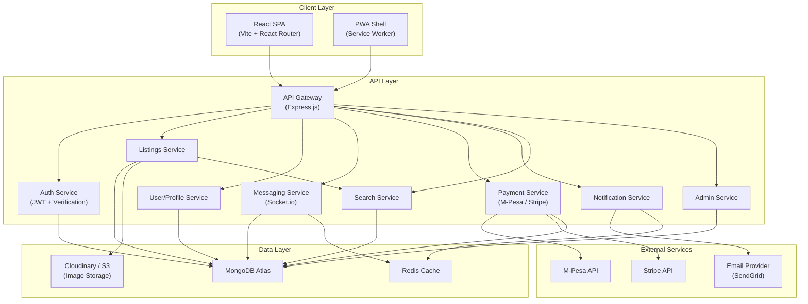
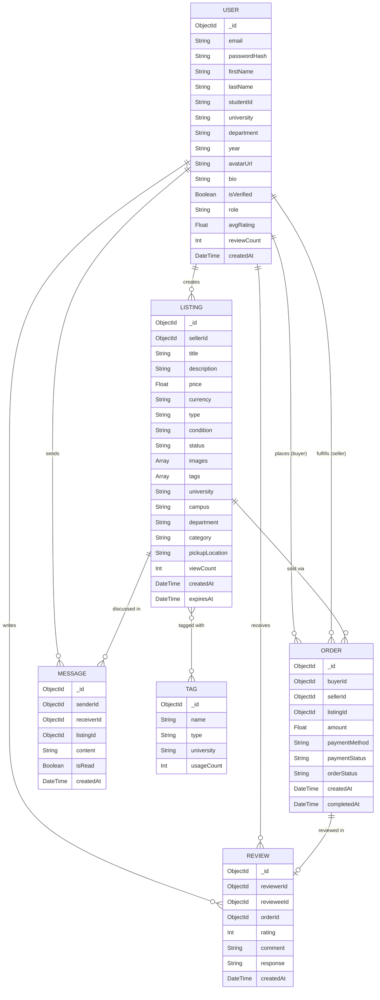
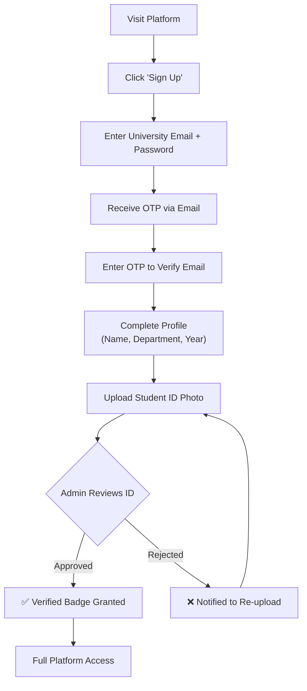
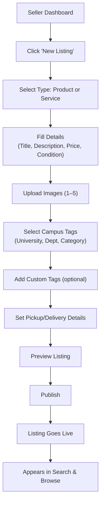
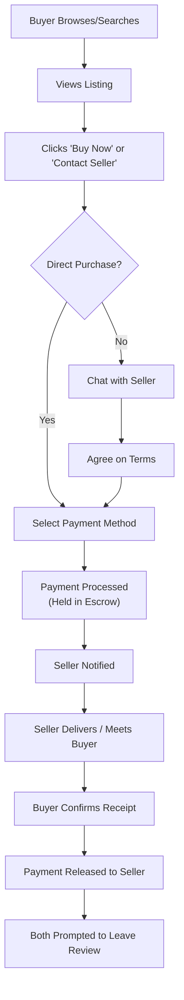
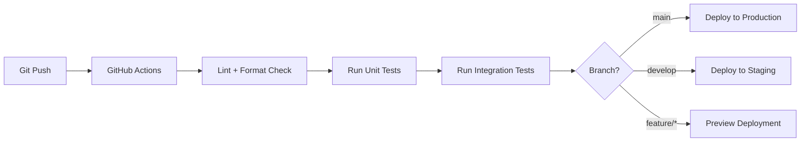

# Product Requirements Document (PRD)
## Student Marketplace Hub — Campus P2P Micro-Business & Commerce Platform

| Field | Detail |
|---|---|
| **Document Version** | 1.0 |
| **Date** | July 8, 2026 |
| **Status** | Draft — Pending Stakeholder Review |
| **Project Type** | Mini Project / Capstone |

---

## 1. Executive Summary

The **Student Marketplace Hub** is a web-based peer-to-peer (P2P) micro-business and commerce platform purpose-built for university students. It replaces fragmented, informal commerce channels — such as WhatsApp groups, Telegram channels, notice boards, and word-of-mouth — with a centralized, structured, and secure digital marketplace.

The platform empowers student entrepreneurs to create storefronts, list products and services, and transact safely with verified campus peers. A unique **campus-specific tagging system** enhances local discoverability, while integrated identity verification, ratings, and secure payments build trust within the campus ecosystem.

> [!IMPORTANT]
> This PRD is derived from the Mini Project Proposal document. All scope, objectives, and deliverables reflect the approved proposal unless explicitly noted as extensions.

---

## 2. Problem Statement

### 2.1 Current Landscape

University students actively buy and sell products and services among themselves — textbooks, electronics, tutoring, design work, food delivery, event tickets, and more. However, this commerce currently occurs through:

- **Unstructured social media channels** (WhatsApp groups, Telegram, Instagram stories)
- **Physical notice boards** with limited reach and no verification
- **Word-of-mouth referrals** that don't scale
- **Generic platforms** (e.g., OLX, Facebook Marketplace) that are not campus-aware

### 2.2 Core Problems

| # | Problem | Impact |
|---|---------|--------|
| P1 | **Fragmentation** — Commerce is scattered across dozens of informal channels | Students miss relevant offers; sellers can't reach their audience |
| P2 | **Trust & Safety deficit** — No identity verification, no ratings, no dispute resolution | High fraud risk; students avoid P2P transactions |
| P3 | **Payment insecurity** — Cash-only or unprotected mobile transfers | No recourse for failed deliveries or scams |
| P4 | **Poor discoverability** — No search, no categories, no campus-local filtering | Relevant products/services are buried in noise |
| P5 | **No entrepreneurship support** — Students lack professional storefronts | Limits growth of student micro-businesses |
| P6 | **No institutional integration** — University admin has no visibility into campus commerce | Missed opportunities for support, regulation, and student welfare |

### 2.3 Opportunity

There is a clear market gap for a **campus-native, student-verified, P2P marketplace** that combines the ease of social commerce with the structure, safety, and discoverability of professional e-commerce platforms.

---

## 3. Project Objectives

### 3.1 Main Goals

1. **Develop a responsive web-based marketplace** tailored to university students for buying and selling products and services within campus.
2. **Implement a campus-specific tagging system** for efficient product/service discovery filtered by university, department, campus location, and category.
3. **Integrate secure identity verification** using university credentials (student email / ID validation) to ensure only verified students participate.
4. **Build a trust framework** including seller/buyer ratings, reviews, transaction history, and dispute resolution mechanisms.
5. **Enable secure payment processing** through integrated payment gateways (mobile money, card payments) with escrow-style protection.
6. **Design a scalable, multi-university architecture** that can be expanded to additional institutions without major re-engineering.

### 3.2 Key Phases

| Phase | Name | Focus | Timeline |
|-------|------|-------|----------|
| **Phase 1** | Foundation & Core MVP | User auth, profiles, product listings, search & campus tags | Weeks 1–4 |
| **Phase 2** | Trust & Transactions | Ratings, reviews, messaging, payment integration | Weeks 5–8 |
| **Phase 3** | Polish & Launch | Admin dashboard, analytics, testing, deployment | Weeks 9–12 |

---

## 4. Target Users & Personas

### 4.1 Primary Personas

#### Persona 1: Student Seller (Entrepreneur)
| Attribute | Detail |
|-----------|--------|
| **Who** | University student running a micro-business (e.g., selling snacks, offering tutoring, freelance design) |
| **Goal** | Reach campus buyers, build a reputation, manage orders |
| **Pain Points** | No professional storefront; relies on WhatsApp broadcasts; can't build trust at scale |
| **Needs** | Product listing tools, order management, ratings visibility, payment collection |

#### Persona 2: Student Buyer (Consumer)
| Attribute | Detail |
|-----------|--------|
| **Who** | University student looking for products/services within campus |
| **Goal** | Find, compare, and safely purchase from verified campus sellers |
| **Pain Points** | Can't find relevant offers; fears scams; no way to verify seller quality |
| **Needs** | Search & browse with campus tags, verified seller badges, secure checkout |

#### Persona 3: Platform Administrator
| Attribute | Detail |
|-----------|--------|
| **Who** | System admin or university representative managing the platform |
| **Goal** | Monitor activity, manage users, handle disputes, view analytics |
| **Pain Points** | No visibility into campus commerce; no tools to enforce guidelines |
| **Needs** | Admin dashboard, user management, content moderation, reporting |

### 4.2 Secondary Users
- **University Administration** — Oversight and potential integration with student affairs
- **Student Organizations** — Promoting events, services, or group purchases

---

## 5. Scope & Feature Requirements

### 5.1 Functional Requirements

#### FR1: User Registration & Authentication
| ID | Requirement | Priority |
|----|------------|----------|
| FR1.1 | Student registration using university email (.edu / institutional domain) | **Must Have** |
| FR1.2 | Email verification with OTP | **Must Have** |
| FR1.3 | Student ID validation (upload + manual/automated review) | **Must Have** |
| FR1.4 | Secure login with JWT-based session management | **Must Have** |
| FR1.5 | Password reset flow via email | **Must Have** |
| FR1.6 | OAuth social login (Google) as secondary option | **Should Have** |
| FR1.7 | Verified student badge on profile upon successful verification | **Must Have** |

#### FR2: User Profiles & Storefronts
| ID | Requirement | Priority |
|----|------------|----------|
| FR2.1 | User profile with avatar, bio, university, department, year | **Must Have** |
| FR2.2 | Seller storefront page with banner, description, and product grid | **Must Have** |
| FR2.3 | Profile displays aggregate rating, review count, and member-since date | **Must Have** |
| FR2.4 | Toggle between buyer and seller modes | **Should Have** |
| FR2.5 | Transaction history visible on profile (private) | **Must Have** |

#### FR3: Product & Service Listings
| ID | Requirement | Priority |
|----|------------|----------|
| FR3.1 | Create listing with title, description, price, images (up to 5), and category | **Must Have** |
| FR3.2 | Support for both **Products** (physical goods) and **Services** (tutoring, design, etc.) | **Must Have** |
| FR3.3 | Listing status management: Active, Sold, Paused, Expired | **Must Have** |
| FR3.4 | Edit and delete own listings | **Must Have** |
| FR3.5 | Listing expiration with auto-archive after configurable period | **Should Have** |
| FR3.6 | Featured/promoted listing capability | **Could Have** |

#### FR4: Campus-Specific Tagging System
| ID | Requirement | Priority |
|----|------------|----------|
| FR4.1 | Multi-level taxonomy: University → Campus → Department → Category | **Must Have** |
| FR4.2 | Predefined category tags (Textbooks, Electronics, Food, Tutoring, Events, Services, Fashion, etc.) | **Must Have** |
| FR4.3 | Custom tags added by sellers (free-form, moderated) | **Should Have** |
| FR4.4 | Location tags for on-campus pickup/delivery points | **Should Have** |
| FR4.5 | Tag-based filtering and faceted search | **Must Have** |
| FR4.6 | Trending tags surfaced on homepage | **Could Have** |

#### FR5: Search & Discovery
| ID | Requirement | Priority |
|----|------------|----------|
| FR5.1 | Full-text search across listing titles and descriptions | **Must Have** |
| FR5.2 | Filter by: category, price range, condition, campus, department | **Must Have** |
| FR5.3 | Sort by: newest, price (low/high), rating, popularity | **Must Have** |
| FR5.4 | Campus-scoped default view (show my university first) | **Must Have** |
| FR5.5 | Saved searches and alerts for new matching listings | **Could Have** |
| FR5.6 | Recommendation engine based on browsing history | **Could Have** |

#### FR6: Messaging & Communication
| ID | Requirement | Priority |
|----|------------|----------|
| FR6.1 | In-app real-time messaging between buyer and seller | **Must Have** |
| FR6.2 | Message threads linked to specific listings | **Must Have** |
| FR6.3 | Push/email notifications for new messages | **Should Have** |
| FR6.4 | Ability to share images and location in chat | **Should Have** |
| FR6.5 | Block and report user functionality | **Must Have** |

#### FR7: Ratings & Reviews
| ID | Requirement | Priority |
|----|------------|----------|
| FR7.1 | Post-transaction rating (1–5 stars) and written review | **Must Have** |
| FR7.2 | Only verified buyers of a listing can leave a review | **Must Have** |
| FR7.3 | Seller can respond to reviews | **Should Have** |
| FR7.4 | Aggregate rating displayed on seller profile and listings | **Must Have** |
| FR7.5 | Review moderation for inappropriate content | **Must Have** |

#### FR8: Payments & Transactions
| ID | Requirement | Priority |
|----|------------|----------|
| FR8.1 | Integrated payment gateway (mobile money: M-Pesa, Airtel Money; and/or card payments) | **Must Have** |
| FR8.2 | Escrow-style payment hold until buyer confirms receipt | **Should Have** |
| FR8.3 | Transaction receipt generation | **Must Have** |
| FR8.4 | Seller payout/withdrawal to linked account | **Must Have** |
| FR8.5 | Transaction fee structure (platform commission) | **Should Have** |
| FR8.6 | Refund and dispute resolution workflow | **Should Have** |

#### FR9: Notifications
| ID | Requirement | Priority |
|----|------------|----------|
| FR9.1 | In-app notification center | **Must Have** |
| FR9.2 | Email notifications for key events (new order, message, review) | **Must Have** |
| FR9.3 | Push notifications (PWA/browser) | **Should Have** |
| FR9.4 | Notification preferences and mute controls | **Should Have** |

#### FR10: Admin Dashboard
| ID | Requirement | Priority |
|----|------------|----------|
| FR10.1 | User management (view, suspend, verify, delete) | **Must Have** |
| FR10.2 | Listing moderation (approve, flag, remove) | **Must Have** |
| FR10.3 | Reported content / dispute queue | **Must Have** |
| FR10.4 | Platform analytics (active users, listings, transactions, revenue) | **Should Have** |
| FR10.5 | University/campus management (add, configure) | **Must Have** |
| FR10.6 | Content and tag management | **Should Have** |

---

### 5.2 Non-Functional Requirements

| ID | Category | Requirement | Target |
|----|----------|-------------|--------|
| NFR1 | **Performance** | Page load time | < 2 seconds on 3G |
| NFR2 | **Performance** | API response time | < 500ms (p95) |
| NFR3 | **Scalability** | Concurrent users | Support 1,000+ concurrent users |
| NFR4 | **Scalability** | Multi-tenancy | Support multiple universities without code changes |
| NFR5 | **Availability** | Uptime | 99.5% availability |
| NFR6 | **Security** | Data encryption | TLS 1.2+ in transit; AES-256 at rest |
| NFR7 | **Security** | Authentication | JWT with refresh tokens; bcrypt password hashing |
| NFR8 | **Security** | Input validation | Server-side validation on all endpoints; XSS/CSRF protection |
| NFR9 | **Usability** | Responsive design | Mobile-first; support viewport widths 320px–1920px |
| NFR10 | **Usability** | Accessibility | WCAG 2.1 AA compliance |
| NFR11 | **Maintainability** | Code quality | Modular architecture; documented APIs; >70% test coverage |
| NFR12 | **Compliance** | Data privacy | GDPR-aligned data handling; user data export/deletion |

---

## 6. Technology Stack

| Layer | Technology | Justification |
|-------|-----------|---------------|
| **Frontend** | React.js (with Vite) | Component-based UI; large ecosystem; fast dev iteration |
| **Styling** | Tailwind CSS | Utility-first; rapid prototyping; responsive by default |
| **State Management** | React Context + Zustand | Lightweight; sufficient for this scope |
| **Routing** | React Router v6 | Standard SPA routing |
| **Backend** | Node.js + Express.js | JavaScript full-stack consistency; async I/O for real-time features |
| **Database** | MongoDB (with Mongoose ODM) | Flexible schema for varied listing types; JSON-native |
| **Authentication** | JWT + bcrypt | Stateless auth; industry-standard password hashing |
| **File Storage** | Cloudinary / AWS S3 | Image upload, transformation, and CDN delivery |
| **Real-time** | Socket.io | In-app messaging and live notifications |
| **Payments** | M-Pesa API / Stripe | Mobile money for local market; Stripe for card fallback |
| **Search** | MongoDB Atlas Search / Algolia | Full-text search with faceted filtering |
| **Deployment** | Vercel (frontend) + Render/Railway (backend) | Free tiers available; easy CI/CD; student-friendly |
| **Version Control** | Git + GitHub | Standard; supports collaboration and CI/CD |
| **Testing** | Jest + React Testing Library + Supertest | Unit, integration, and API testing |

> [!NOTE]
> Technology choices prioritize **developer velocity**, **cost-efficiency** (free tiers), and **full-stack JavaScript** consistency suitable for a student project team.

---

## 7. System Architecture

### 7.1 High-Level Architecture



### 7.2 Data Model (Core Entities)



---

## 8. User Flows

### 8.1 Student Registration & Verification Flow



### 8.2 Listing Creation Flow



### 8.3 Purchase / Transaction Flow



---

## 9. UI/UX Requirements

### 9.1 Design Principles
1. **Mobile-First** — Majority of student users will access via smartphones
2. **Clean & Modern** — Minimalist design with vibrant campus-themed accents
3. **Fast & Intuitive** — Minimal clicks to complete any action; progressive disclosure
4. **Trust-Forward** — Verification badges, ratings, and secure-payment indicators are always visible
5. **Accessible** — High contrast, readable fonts, keyboard navigable

### 9.2 Key Screens

| Screen | Description | Key Elements |
|--------|-------------|--------------|
| **Home / Feed** | Campus-scoped listing feed with search bar | Search bar, category chips, trending tags, listing cards |
| **Search Results** | Filtered listing grid with faceted sidebar | Filters (category, price, condition, campus), sort dropdown, listing cards |
| **Listing Detail** | Full product/service page | Image carousel, seller info with rating, price, description, tags, action buttons |
| **Seller Storefront** | Public profile with all active listings | Banner, bio, aggregate rating, listing grid, reviews tab |
| **Create Listing** | Multi-step listing creation form | Type selection, details form, image uploader, tag selector, preview |
| **Messages** | Conversation list and chat view | Thread list, real-time chat, listing context card |
| **User Profile** | Private profile with settings and history | Profile editor, transaction history, saved items, settings |
| **Checkout** | Payment flow | Order summary, payment method selection, confirmation |
| **Admin Dashboard** | Platform management interface | Stats overview, user table, listing queue, dispute list, analytics charts |

### 9.3 Responsive Breakpoints

| Breakpoint | Width | Layout |
|------------|-------|--------|
| Mobile | < 640px | Single column, bottom nav |
| Tablet | 640px – 1024px | Two-column grid, sidebar nav |
| Desktop | > 1024px | Three-column grid, top nav + sidebar |

---

## 10. API Design (Core Endpoints)

### 10.1 Authentication

| Method | Endpoint | Description |
|--------|----------|-------------|
| POST | `/api/auth/register` | Register new student account |
| POST | `/api/auth/verify-email` | Verify email with OTP |
| POST | `/api/auth/login` | Login and receive JWT |
| POST | `/api/auth/refresh` | Refresh access token |
| POST | `/api/auth/forgot-password` | Initiate password reset |
| POST | `/api/auth/reset-password` | Complete password reset |

### 10.2 Users & Profiles

| Method | Endpoint | Description |
|--------|----------|-------------|
| GET | `/api/users/me` | Get current user profile |
| PUT | `/api/users/me` | Update current user profile |
| POST | `/api/users/me/verify` | Submit student ID for verification |
| GET | `/api/users/:id` | Get public user profile |
| GET | `/api/users/:id/listings` | Get user's active listings |
| GET | `/api/users/:id/reviews` | Get user's reviews |

### 10.3 Listings

| Method | Endpoint | Description |
|--------|----------|-------------|
| POST | `/api/listings` | Create new listing |
| GET | `/api/listings` | Browse/search listings (with query params) |
| GET | `/api/listings/:id` | Get listing detail |
| PUT | `/api/listings/:id` | Update listing |
| DELETE | `/api/listings/:id` | Delete listing |
| PATCH | `/api/listings/:id/status` | Update listing status |

### 10.4 Orders & Payments

| Method | Endpoint | Description |
|--------|----------|-------------|
| POST | `/api/orders` | Create order / initiate purchase |
| GET | `/api/orders` | Get user's orders (buyer/seller) |
| GET | `/api/orders/:id` | Get order detail |
| POST | `/api/orders/:id/confirm` | Buyer confirms receipt |
| POST | `/api/orders/:id/dispute` | Open a dispute |
| POST | `/api/payments/initiate` | Initiate payment (M-Pesa STK push / Stripe) |
| POST | `/api/payments/callback` | Payment provider webhook |

### 10.5 Messaging

| Method | Endpoint | Description |
|--------|----------|-------------|
| GET | `/api/messages/threads` | Get all conversation threads |
| GET | `/api/messages/threads/:id` | Get messages in a thread |
| POST | `/api/messages` | Send a message |
| WS | `/ws/messages` | Real-time message streaming (Socket.io) |

### 10.6 Reviews

| Method | Endpoint | Description |
|--------|----------|-------------|
| POST | `/api/reviews` | Submit a review |
| GET | `/api/reviews/listing/:id` | Get reviews for a listing's seller |
| POST | `/api/reviews/:id/respond` | Seller responds to review |

### 10.7 Tags & Categories

| Method | Endpoint | Description |
|--------|----------|-------------|
| GET | `/api/tags` | Get all tags (filter by university, type) |
| GET | `/api/categories` | Get category hierarchy |
| GET | `/api/tags/trending` | Get trending tags |

### 10.8 Admin

| Method | Endpoint | Description |
|--------|----------|-------------|
| GET | `/api/admin/users` | List all users (paginated, filterable) |
| PATCH | `/api/admin/users/:id` | Update user status (suspend, verify) |
| GET | `/api/admin/listings` | List all listings (moderation queue) |
| PATCH | `/api/admin/listings/:id` | Moderate listing (approve, flag, remove) |
| GET | `/api/admin/disputes` | List open disputes |
| PATCH | `/api/admin/disputes/:id` | Resolve dispute |
| GET | `/api/admin/analytics` | Platform analytics summary |

---

## 11. Security Requirements

| Area | Requirement |
|------|-------------|
| **Authentication** | JWT access tokens (15min expiry) + refresh tokens (7-day expiry, httpOnly cookie) |
| **Password Storage** | bcrypt with minimum 12 salt rounds |
| **API Security** | Rate limiting (100 req/min per user); CORS whitelist; Helmet.js headers |
| **Input Validation** | Joi/Zod schema validation on all request bodies; sanitize HTML inputs |
| **XSS Prevention** | Content Security Policy headers; React's default escaping |
| **CSRF Protection** | SameSite cookies; CSRF tokens on state-changing requests |
| **File Uploads** | Validate MIME types; max file size 5MB; scan for malicious content |
| **Data Privacy** | User data encrypted at rest; minimal data collection; user deletion capability |
| **Payment Security** | PCI DSS compliance via payment provider SDKs; no raw card data stored |
| **Audit Logging** | Log all admin actions, authentication events, and payment transactions |

---

## 12. Testing Strategy

### 12.1 Testing Levels

| Level | Scope | Tools | Coverage Target |
|-------|-------|-------|-----------------|
| **Unit Tests** | Individual functions, utilities, hooks | Jest | > 80% |
| **Component Tests** | React component rendering and interaction | React Testing Library | > 70% |
| **API Tests** | Backend endpoint validation | Supertest + Jest | > 85% |
| **Integration Tests** | Multi-service workflows (e.g., order flow) | Supertest | Key flows covered |
| **E2E Tests** | Full user journeys in browser | Cypress / Playwright | Top 5 critical paths |

### 12.2 Critical Test Scenarios

1. Student registration → email verification → ID upload → admin approval → verified status
2. Create listing → appears in search → buyer views → initiates purchase
3. Payment initiation → escrow hold → delivery confirmation → payout
4. Buyer leaves review → appears on seller profile → seller responds
5. Real-time messaging between buyer and seller
6. Admin suspends user → user loses access → listings hidden
7. Disputed transaction → admin resolution → refund or release

---

## 13. Deployment & DevOps

### 13.1 Environment Strategy

| Environment | Purpose | URL Pattern |
|-------------|---------|-------------|
| **Development** | Local development | `localhost:3000` / `localhost:5000` |
| **Staging** | Pre-release testing | `staging.studentmarketplace.app` |
| **Production** | Live platform | `studentmarketplace.app` |

### 13.2 CI/CD Pipeline



### 13.3 Infrastructure

| Component | Service | Tier |
|-----------|---------|------|
| Frontend Hosting | Vercel | Free (Hobby) |
| Backend Hosting | Render / Railway | Free / Starter |
| Database | MongoDB Atlas | Free (M0 Shared) |
| Image CDN | Cloudinary | Free (25K transforms/mo) |
| Email | SendGrid | Free (100 emails/day) |
| Monitoring | UptimeRobot + LogRocket | Free tiers |

---

## 14. Project Timeline & Milestones

### 14.1 Detailed Timeline (12 Weeks)

| Week | Phase | Deliverables |
|------|-------|-------------|
| **1** | Setup & Planning | Project setup, repo init, dev environment, DB schema design |
| **2** | Auth System | Registration, login, email verification, JWT middleware |
| **3** | User Profiles | Profile CRUD, student ID upload, avatar management |
| **4** | Listings Core | Create/edit/delete listings, image upload, categories |
| **5** | Campus Tags & Search | Tagging system, full-text search, faceted filtering |
| **6** | Messaging | Real-time chat with Socket.io, message threads |
| **7** | Payments | Payment gateway integration, order flow, escrow logic |
| **8** | Ratings & Reviews | Post-transaction reviews, seller ratings, moderation |
| **9** | Admin Dashboard | User management, listing moderation, dispute handling |
| **10** | Analytics & Notifications | Platform analytics, email/push notifications |
| **11** | Testing & QA | Comprehensive testing, bug fixes, performance optimization |
| **12** | Deployment & Documentation | Production deployment, user guide, technical documentation |

### 14.2 Key Milestones

| Milestone | Target Date | Success Criteria |
|-----------|------------|------------------|
| **M1: Core MVP** | End of Week 4 | Users can register, verify, and create/browse listings |
| **M2: Transactional MVP** | End of Week 8 | Users can buy, pay, review, and message |
| **M3: Admin-Ready** | End of Week 10 | Admin can manage users, listings, and disputes |
| **M4: Production Launch** | End of Week 12 | Platform deployed, tested, and documented |

---

## 15. Success Metrics & KPIs

| Metric | Target (3 months post-launch) | Measurement Method |
|--------|-------------------------------|-------------------|
| **Registered Users** | 500+ verified students | Database count |
| **Active Listings** | 200+ live listings | Dashboard analytics |
| **Monthly Transactions** | 50+ completed orders | Order records |
| **User Satisfaction** | > 4.0/5.0 average rating | Platform reviews |
| **Platform Uptime** | > 99.5% | Monitoring service |
| **Search Success Rate** | > 70% searches result in listing view | Analytics tracking |
| **Repeat Usage** | > 40% monthly active users return | User analytics |

---

## 16. Expected Outcomes & Impact

1. **Centralized Campus Commerce** — Provide a structured marketplace for student commerce, replacing fragmented informal channels.
2. **Student Entrepreneurship** — Empower student entrepreneurs by giving them a professional platform to showcase and market their products and services.
3. **Trust & Safety** — Improve trust and safety in campus P2P transactions through verified accounts, ratings, and secure payments.
4. **Enhanced Discoverability** — Enhance discoverability of campus-local products and services through the campus-tagging system.
5. **Scalable Multi-University Model** — Demonstrate the feasibility of a scalable, multi-university marketplace platform that can be expanded to additional institutions over time.
6. **Academic Contribution** — Contribute to the growing body of knowledge on student-focused e-commerce platforms and campus digital ecosystems.

---

## 17. Risks & Mitigations

| # | Risk | Likelihood | Impact | Mitigation |
|---|------|-----------|--------|------------|
| R1 | Low initial adoption | Medium | High | Launch with targeted marketing; seed with initial listings; partner with student orgs |
| R2 | Payment integration complexity | Medium | High | Start with M-Pesa STK push (well-documented); use sandbox extensively |
| R3 | Trust issues (fraud/scams) | Medium | Critical | Mandatory verification; escrow payments; report system; admin oversight |
| R4 | Scope creep | High | Medium | Strict MVP scope; defer "Could Have" features to post-launch |
| R5 | Performance under load | Low | Medium | Load testing in Week 11; MongoDB indexing; CDN for assets |
| R6 | Data privacy compliance | Low | High | GDPR-aligned practices from day one; minimal data collection |
| R7 | Team bandwidth constraints | Medium | Medium | Modular architecture enables parallel work; clear task ownership |

---

## 18. Assumptions & Constraints

### 18.1 Assumptions
- Students have access to smartphones with internet connectivity
- University email domains can be used for verification
- M-Pesa API access can be obtained for development/testing
- Target universities will not block or restrict the platform
- Student user base is willing to adopt a new platform

### 18.2 Constraints
- **Budget**: Zero or minimal budget (leveraging free tiers)
- **Timeline**: 12-week development window
- **Team Size**: Small team (mini project scope)
- **Infrastructure**: Reliance on cloud free tiers limits scalability initially
- **Regulatory**: Must comply with university policies on student commerce

---

## 19. Glossary

| Term | Definition |
|------|-----------|
| **P2P** | Peer-to-peer; direct transactions between students |
| **MVP** | Minimum Viable Product; the smallest feature set for launch |
| **Escrow** | Payment held by platform until buyer confirms delivery |
| **Campus Tag** | A metadata label linking a listing to a specific university, department, or location |
| **Verified Badge** | Visual indicator that a user's student identity has been confirmed |
| **Storefront** | A seller's public profile page showcasing their listings |
| **STK Push** | M-Pesa's SIM Toolkit Push; a payment prompt sent to user's phone |
| **OTP** | One-Time Password; used for email verification |
| **JWT** | JSON Web Token; used for stateless authentication |

---

## 20. Appendices

### Appendix A: Listing Category Taxonomy

```
├── Textbooks & Study Materials
│   ├── Textbooks
│   ├── Notes & Past Papers
│   └── Lab Manuals
├── Electronics & Gadgets
│   ├── Phones & Accessories
│   ├── Laptops & Tablets
│   └── Chargers & Cables
├── Fashion & Clothing
│   ├── Clothing
│   ├── Shoes
│   └── Accessories
├── Food & Beverages
│   ├── Homemade Meals
│   ├── Snacks & Drinks
│   └── Catering Services
├── Services
│   ├── Tutoring
│   ├── Design & Creative
│   ├── Writing & Editing
│   ├── Tech & Programming
│   └── Photography & Video
├── Events & Entertainment
│   ├── Event Tickets
│   ├── DJ & Music
│   └── Party Planning
├── Housing & Roommates
│   ├── Room Rentals
│   ├── Roommate Finder
│   └── Furniture
└── Miscellaneous
    ├── Lost & Found
    ├── Free Items
    └── Other
```

### Appendix B: University Onboarding Checklist

| Step | Task | Owner |
|------|------|-------|
| 1 | Confirm university email domain format | Admin |
| 2 | Configure university entity in admin panel | Admin |
| 3 | Define campus locations and departments | Admin + University Rep |
| 4 | Set up initial category tags | Admin |
| 5 | Create campus ambassador accounts | Admin |
| 6 | Seed 20+ initial listings | Campus Ambassadors |
| 7 | Launch campus marketing campaign | Marketing Team |

---

> [!TIP]
> This document should be reviewed and updated at each milestone. Feature priorities may shift based on user feedback gathered during early testing phases.

---

*End of PRD — Student Marketplace Hub v1.0*
